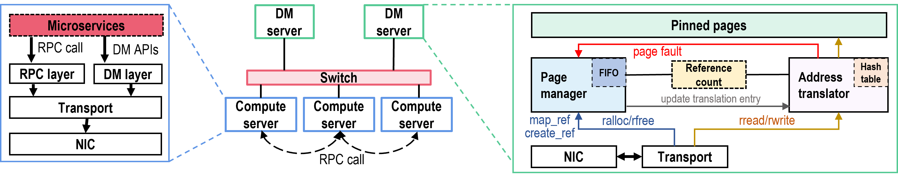

## DmRPC: Disaggregated Memory-aware Datacenter RPC for Data-intensive Applications

DmRPC is a fast RPC lib for Data-intensive Applications and Disaggregated Memory, which is the first DM-aware datacenter RPC for data-intensive datacenter applications.

**Some highlights:**

- Pass by reference: use pass by reference instead of pass by value.
- Multiple supported disaggregate memory: support Network(RoCE/Ethernet) and CXL.
- Easy to program: use copy-on-write mechanism to provide programming simplicity.
- Much faster than [Ray](https://www.ray.io/) and [Spark](https://spark.apache.org/):  DmRPC designed for fine-grained microservices. In our micro-benchmark, DmRPC achieves up to **21.6 $\times$ / 5.6 $\times$** higher throughput compore with Ray/Spark.
- High performance: get  **3.1 $\times$** higher throughput and **2.5 $\times$** lower average latency than the baseline on DeathStarBench test suites, and get great performance for synthetic 7-tier microservices.

### Architecture

DmRPC-net Architecture

### System requirements

- NICs: 100GbE+ NICs are needed for good performance. DmRPC works best with Mellanox Ethernet(Connect-Serial) NICs. Any DPDK-capable NICs also work well.
- HugePage: At least 2048 huge pages on specific NUMA node

### Directory Structure:
~~~
├── cn  (client node)
│   ├── app
│   │   ├── address_translate   (address translate speed test)
│   │   ├── bandwidth_read_test  (read bandwidth test)
│   │   ├── bandwidth_write_test (write bandwidth test)
│   │   ├── fork_speed (create reference speed test)
│   │   ├── fork_test (cow ratio speed test)
│   │   ├── img_transcode ( synthetic 7-tier microservices test)
│   │   ├── latency_test 
│   │   ├── simple_test
│   │   └── social_network (death star bench test suite)
│   └── rmem_ulib (client DmRPC user lib)
│       └── impl
├── extra
│   ├── ray
│   └── spark
├── include
├── mn (DmRPC memory node )
├── scripts (Test scripts)
├── third_party
└── util
~~~

### Dependency:

| Package  | Version |
| -------- | ------- |
| mongoc   | 1.7     |
| protobuf | 3.21    |
| dpdk     | 21.05   |
| g++      | >7.5.0  |

### QuickStart

- Build and run memory node:
  - install dependency packages
  - `mkdir build; cd build && cmake ..; make -j`
  - run `sudo ./rmem_mn`

- Run different tests
  - replace folder name in `/cn/app/build_app`
  - `cd build && cmake ..; make -j`

- Run ray/spark
  - to `/extra` folder and see ray/spark test code

  

How to deploy different machine's IPs and ports?

- create a file named `app_process_file` in `/cn/app` folder
- write your IP and port in this file
- run you program with  `--client_index` and `--server_index` with specific index in this file

 

### ThirdParty

| project          | Version |
| ---------------- | ------- |
| asio             | latest  |
| eRPC             | latest  |
| atomic_queue     | latest  |
| parallel_hashmap | latest  |
| HdrHistogram_c   | latest  |
| json             | latest  |

### Getting help

Working in the process...

### Contact

email at chenxuz@zju.edu.cn

